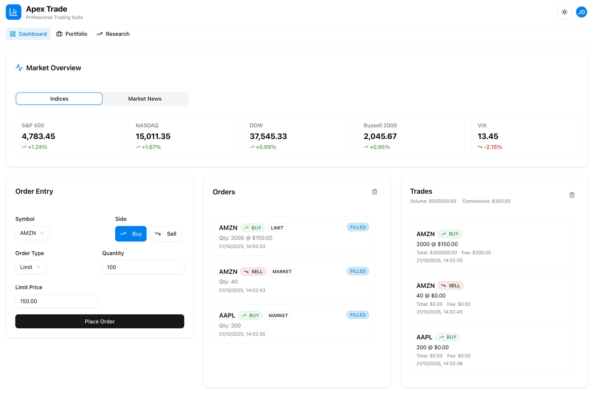

# AI Immersion Day - Guided Tour

This repository contains a sample web application that you can practice your agentic coding skills on. It's a mock institutional trading platform. Some parts have been implemented, others are left up to you.

There are plenty of improvements and fixes you can make to the application in order to learn the ins and outs of agentic coding. See the list of [example tasks](#example-tasks) for ideas!

Here's what the app should look like when you get it running:



## Table of Contents

- [Project Structure](#project-structure)
- [Getting Started](#getting-started)
- [Applications](#applications)
- [Workspace Commands](#workspace-commands)
- [Development Tips](#development-tips)
- [Example Tasks](#example-tasks)

## Project Structure

This project is a monorepo containing a Next.js web application and a Hono API server.

```
guided-tour/
├── apps/
│   ├── web/              # Next.js web application
│   │   └── ...           # React components, pages, styles
│   └── api/              # Hono API server
│       └── src/
│           └── index.ts  # Main API server file
├── package.json          # Root workspace configuration
└── README.md
```

## Getting Started

### Install Dependencies

Install all dependencies for both applications:

```bash
npm install
```

### Development

Run both the web application and API server concurrently:

```bash
npm run dev
```

Or run them individually:

```bash
# Run only the web application (http://localhost:3000)
npm run dev:web

# Run only the API server (http://localhost:3001)
npm run dev:api
```

### Build

Build both applications:

```bash
npm run build
```

Or build individually:

```bash
npm run build:web
npm run build:api
```

## Applications

### Web Application (Next.js)

- **Location**: `apps/web/`
- **Port**: `http://localhost:3000`
- **Tech Stack**: Next.js 15, React 19, TypeScript, Tailwind CSS
- **Features**: 
  - Responsive UI with Tailwind CSS
  - shadcn/ui components
  - Dark mode support

### API Server (Hono)

- **Location**: `apps/api/`
- **Port**: `http://localhost:3001`
- **Tech Stack**: Hono, Node.js, TypeScript
- **Features**:
  - Fast, lightweight API server
  - CORS enabled for web app communication
  - TypeScript support with hot reload

#### Available API Endpoints

- `GET /health` - Health check endpoint
- `POST /api/hello` - Hello world endpoint that receives a name and returns a personalized greeting
  - Request body: `{ "name": "string" }`
  - Response: `{ "message": "Hello {name}!" }`

## Workspace Commands

The project uses NPM workspaces for managing multiple packages:

```bash
# Run commands in specific workspace
npm run dev --workspace=apps/web
npm run dev --workspace=apps/api

# Install package in specific workspace
npm install <package> --workspace=apps/web
npm install <package> --workspace=apps/api
```

## Development Tips

- Both applications run independently and have separate `node_modules`
- The web app can communicate with the API via fetch calls to `http://localhost:3001`
- CORS is configured to allow requests from the web app
- Each application has its own TypeScript configuration
- Changes to either application will hot reload automatically during development

## Testing

The web application includes Jest and React Testing Library for unit testing components.

### Running Tests

```bash
# Run all tests
npm run test --workspace=apps/web

# Run tests in watch mode
npm run test:watch --workspace=apps/web

# Run tests with coverage report
npm run test:coverage --workspace=apps/web
```

### Example Test

An example test has been provided for the `EmptyState` component (`apps/web/src/components/empty-state.test.tsx`). This test demonstrates:

- Basic component rendering
- Testing with default and custom props
- Querying elements
- Accessibility-focused testing

### Exercise for Participants

This example test serves as a foundation for workshop participants to practice using AI coding agents to:

- Expand test coverage to other components in the project
- Add more complex test scenarios (user interactions, async behavior, etc.)
- Learn different testing patterns and best practices
- Practice prompting AI agents to generate and refine tests

Use your AI coding agent to help build comprehensive test coverage throughout the application!

## Example Tasks

Looking for ideas on what to build or improve? Check out our [Example Tasks](docs/EXAMPLE_TASKS.md) document, which contains 50 tasks you can tackle using your AI coding agent to practice agentic coding across the full Software Development Lifecycle.

These tasks range from basic discovery and documentation to complex feature implementation and testing, covering areas such as:

- **Discovery**: Understanding the codebase and architecture
- **Feature Implementation**: Building new functionality (order management, real-time updates, charting, etc.)
- **Testing**: Unit, integration, E2E, and accessibility testing
- **Performance**: Optimization and benchmarking
- **Security**: Vulnerability scanning and hardening
- **Documentation**: Architecture diagrams, API docs, and ADRs
- **UX/UI**: Improving user experience and interactions

The tasks are designed to work with the available MCP tools including Playwright, Chrome DevTools, Context7, and web search capabilities.
